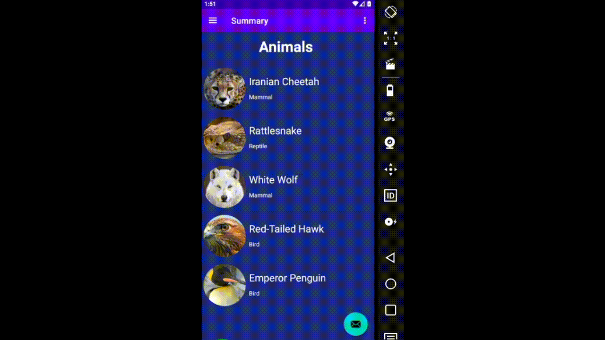

# Mobile Project2 | Navigation Component - MVVM - Single Activity Principle - RecyclerView

**Contributors:**
- Mohammad Amin Taheri / 96521335
- Amir Rezaei / 96521227

  In this project, we have used **Safe Args** to pass data between fragments.
  and **Recyclerview** and **Adapter** to show list of animals.

**Required Data:**  
Animals and Species

**Demo**

And here is the final result of this project.

